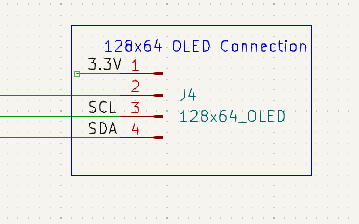

# lipo_battery_drainer
This project describes hardware to safely discharge LIPO batteries to storage levels

# WARNING

Everything described in this document is preliminary and untested and could be
hazardous.  Following anything written in this document is at-your-own risk.

## User Interface

The unit has four UI buttons: On, Off, Select and Start.  Basic usage is
to use select to pick a discharge profile and start to execute it.  The
unit will automatically turn off when it has completed its objective.

The display in use is a 128x64 pixel display.  We will be using a 8x16 pixel
font which allows for a text resolution of 16x4

When the device is initially powered up, it will display the current voltage,
cell count and the target voltage.  There will also be a scrollable list of
profiles to choose from.  Here is a basic example:

```
|6S 25.1V > 22.8V|
|LIPO XT60 x 6   |
|LIPO Single     |
|Settings        |
```

The lower part of the display will be scrollable and allow the user to choose
between different profiles.  Not shown above are separation lines and inverse
text, due to the limitations of "what is easy" in Markdown.

If the user chooses "settings", then an information message will appear:

```
|                |
|Please          |
|connect USB at  |
|115200 baud     |
```

During discharge, the following status information will be displayed:

```
|00:05:32   0.5Ah|
|6S 25.1V > 22.8V|
|15.7A       394W|
|55C  P100%  F25%|
```

Information shown includes:

* Time running
* Number of aH discharged so far
* Battery voltage and cell count
* Target voltage
* Discharge Current
* Power
* Temperature
* FET power level
* Fan power level

If the FET power level is limited < 100%, then the parameter that is limiting
the power is highlighted as inverse text. 

When the discharge is complete, the unit will show some stats for a configurable
amount of time before shutting down.  Here is an example:

```
|00:05:32   0.5Ah|
|6S 22.8V    496s|
|15.7A       394W|
|55C  P100% F100%|
```

During this time, the display time (2nd row, 2nd column) will be displayed in
inverse and will decrement to zero, after which the unit will shut down.  All
values shown will represent the maximum value reached during the discharge
cycle.

## Configuration

Profiles can be edited by connecting a compter to the unit via USB and starting
a termnial program.  On my Linux laptop, I used:

    minicom -b 115200 -P /dev/ttyUSB0

There are two types of configuration: global and profile.

### Global Configuration

Some settings are always used, no matter what profile is selected.

#### Current calibration

The `ical` command is used to calibrate the current measurements.  It's
deault value is 133 milliOhms.  You can measure the resistance across the "Ical"
test point to find a more accurate value.  Example usage:

    ical 0.130

Would set the resistance to 130 milliOhms 

#### Voltage calibration

With a battery connected, measure the voltage at the vcal test point and enter
it with the `vcal` command.  For example:

    vcal 25.4

Note there is a related `vdrop` parameter but this parameter is  per-profile to
accommodate different breakout boards (e.g. whether they have protection diodes).

#### Voltage sag measurements

You can control how often to take voltage sag measurements.

First is `vsag_interval_seconds` which determines how often to take a baseline
measurement.  For example:

    vsag_interval_seconds 15

Next is `vsag_settle_ms` which determines how long to allow the battery to recover before taking a measurement.  For example:

    vsag_settle_ms 1000

#### Fan Settings

Use `fan <min_percent> <min_celsius> <max_celsius>` to control any connected fan(s)
At `min_celsius`, the fan(s) will run at `min_percent` and smoothly ramp to
100% speed at and beyond `max_celsius`. Example:

    fan 20 40 80 

Note that on may fans, using too low of a percent leads to no rotation.

#### Finish Display Time

Use `finish_display <mah_ratio>` to configure the number of seconds
that the finish stats are shown before the unit shuts down.  Example:

    finish_display 0.5

In the example above, if 1000 mAh were pulled from the battery then the display would be active for 1000 * 0.5 = 500 seconds.  If 100 mAh were pulled, then
the display would be active for 100 * 0.5 = 50 seconds.

### Responsiveness

The system looks to open up the FETs as much as possible while keeping under
the current limits of:

* Max voltage sag
* Max current
* Max power
* Max temperature

Thus the goal is to reach one of these maximums while staying under the maximum
for all others.  Which maximum is reached will vary by battery, fan settings, room
temperature, etc.

Coming up with and tuning an optimal PID algorithm that meets the above
requirements would be daunting due to the large number of free variables. For
example we would need to combine all four terms above to define an "error" as a
starting point, then would still need to determine the PID constants.

Fortunately, we do not need to system to converge in minimum time.  By relaxing
this requirement, we can get away with less complex calculations. 

The tuning algorithm is an annealing type algorithm where we use the terms
"velocity" and "acceleration" as a mental model.  As an analogy, imagine trying
to adjust the volume knob on a friend's stereo.  You would likely start with
some gross adjustment until you overshoot the mark, then hunt with increasingly
fine movements until you are satisfied.  If a "loud" commercial comes on,
you will need to adjust it again - again starting a bit fast and fine tuning.

With that in mind, here are the parameters of the algorithm:

* *max_velocity*  The maximum (and starting) velocity in percent / second
* *min_velocity* The minumum allow change velocity in percent / second.
* *deceleration_factor* the amount to decrease the velocity on an overshoot
  (going past the intended mark): from 0 to max_velocity
* *acceleration* the amount to increate the velocity (not reaching
  the intended mark) in percent / second. from 0.0 to max_velocity

Example:

  * max_velocity = 30
  * min_velocity = 0.05
  * deceleration = 0.5
  * acceleration = 0.1

  say the per sample time is 100ms

  The PWM will scale from 0 percent to 100% at 3% per sample, taking 33 samples
  or 3.3 seconds to get there.

  Say instead we hit a limit on the 10th sample.  PWN at this point would
  be 3 * 10 = 30%.  The velocity is reversed and decelerated, becoming
  to (-30 + 0.5) * 0.1 = -2.95% per sample

  On the next sample, PWM will change to 30 - 2.95 = 27.05%  Say that now
  everything is below threshold.  This means that we may have backed off
  too far.  Thus we reverse and decelerate again.  The new velocity becomes
  (29.5 - 0.5) * 0.1 = 2.9% per sample.

  One the next sample, PWM will change to 27.05 + 2.9 = 29.95.  Say that we
  are still too low.  In that case, the acceleration factor kicks in and
  the new velocity is not inverted, becoming (29 + 0.1) * 0.1 = 2.91% per sample.

  and so on.

### Profile Management

#### Create a profile

You can create a profile with the `new` command and a name.  For example:

    new

Profiles are named "New" as a starting point.  Alternately you can duplicate an
existing profile under a new name to use it's settings as a starting point:

    duplicate 0

would take whatever profile is at index zero and copy it under the next
available index.

#### Rename a profile

Change the name of a profile with the `name` command.  e.g.

    name 0 "LIPO 3.8 percell"

#### Delete a profile

Use the delete command with the profile index.  e.g.

    delete 1

#### Move a profile

Move a profile from one index to a different one via `move <source_idx> <dest_idx>`.  e.g.

    move 3 0

#### View profiles

Use the `list` command to view profile names and indexes:

    list

Use the `show` command to view settings for particular indexes or to dump all indexes:

    show
    show 0 2
    show 1 2 3

### Profile Configuration

#### Voltage drop configuration

Use `vdrop <profile_index> <voltage>` to set the voltage difference between the connected
battery and the vcal test point.  This will take into consideration various FETs and
diodes that exist between the two points. Example:

    vdrop 1 0.75

#### Cell count

Use `cell_count <profile_index> <count>` to adjust the number of cells.  If set at zero,
the number of cells will be automatically calculated at start by dividing the voltage
by the `per_cell_target_volts` (see below).  If the automatic calcualtion would lead to incorrect
results in your situation, you'll need to fix the value.

Note that you can also use a value of `1` if you don't want to think in terms of cells
but only the full voltage.  Examples:

    cell_count 1 0
    cell_count 1 1
    cell_count 1 6

#### Target voltage

Sets the per-cell target voltage.  When the target voltage is reached, the unit
will shut off.  For example:

    per_cell_target_volts 1 3.8

Would set the target voltage to 3.8 if `cell_count` is 1, 7.6 if `cell_count` is 2,
etc.

    per_cell_target_volts 1 0.0

Will run the drainer until it can no longer power itself, regardless of the cell count.

#### Damage voltage warning

If the target voltage is set below the `damage_voltage`, the user will be told that
they are about to destroy the connected batteries and will ask for confirmation.
The default settings is for LIPO batteries and is set to 3.3 volts.  Change it
with the `damage_voltage` command:

    damage_voltage 1 3.0

#### Max current

Use `max_amps <profile_index> <current>` to set the maximum allowed current.  Example

    max_amps 1 10.0

#### Max per-cell voltage sag

Use `per_cell_max_vsag <profile_index> <sag>` to determine the maximum amount of 
per-cell voltage sag that is allowed.  For example:

    per_cell_max_vsag 1 0.4

Would allow up to 0.4 * 4 = 1.6V of sag on a 4 cell pack.

#### Max temperature

Use `max_celsius <profile_index> <temp>` to change the maximum allowed heatsink termerature.  Example:

    max_celsius 1 80.0

#### Max Power

Use `max_watts <profile_indx> <watts>` to change the maximum allowed wattage (voltage * current).  Example:

    max_watts 1 150

## Parts list

To see the parts list, open up the schematic in KiCad and look at the "Symbol
Fields Table".  It looks like a spreadsheet icon in the UI.  Here you will find
a list of parts and links for building an order.  Here is a snapshot of what
the list looked like at some point:


## Schematic Overview

Note that the images below are a snapshot of the schematic and not fully
up-tp-date.  See the kicad original for the latest design.

Here is the complete design (click to expand):


Here is an early falstad simulation that gives a basic idea of how the cicuit works:

https://tinyurl.com/2qg4xwyj

There is much going on here.  The sections below break down and explain one
subcircuit at a time.

### Power Dissipation

[falstad model](https://tinyurl.com/28p9fv3n)

This is a set of 4 P-Channel MOSFETs connected in parallel:


More or less could also work.  More means more overall current and better heat
dissipation but also additional cost and board space.

These are intended to be run in the "Ohmic" region of the FETs which
is controlled by the gate-to-source voltage (Vgs) as exampled in the FQP27P06
datasheet graph below:


> Note: The schematic has been updated to use an alternate PFET due to the
FQP27P06 no longer being produced.

### Vgs Control

[falstad model](https://tinyurl.com/2bj46fut)

To achieve the target Vgs for the MOSFETs, we use a capacitor as detailed
below:


The main element here is the 10u capacitor on the right side of the image.  This
capacitor is filled and emptied to set the Vgs that each MOSFET will see.

Filling the capacitor is the 5k resistor, R16.  If only this resistor and the
capacitor existed, then the RC constant would be 5000 * 10e-6 = 50ms.  When the
capacitor is sufficiently charged, the MOSFETs will be turned off.

The two transistor networks are used to drain the capacitor.  The one on the
left is a "slow" drain and the one on the right is a "fast" drain.  The size of
the resistors (R17 and R20) at the collector determines the drain speed.  A
microcontroller feeds in a PWM signal with a varying duty cycle to control how
much charge they pull from the capacitor thus determining the Vgs value.

In the power-on state, we can assume that SLOW and FAST are not driven at all
(high Z).  In this state the two 50k pulldowns (R14, R18) turn off Q6 and Q9
allowing the capacitor to fill up and turn off all MOSFETs.

The 100K pull down resistor slowly drains the capacitor so that it is in a known
state (0V) when the unit is unplugged and idle.  Omitting can create a situation
where Vgs is temporarily higher than the plugged in battery, which could lead to
some side effects such as temporary Vgs oscillation as the firmware searches for
the correct duty cycles for SLOW and FAST.

## Inrush protection

[falstad model](https://tinyurl.com/2y8c54c8)

There is inrush current potential on initial plugin as the 100ms or so it takes
the capacitor (C4) to charge via R16 could allow a high current to pass through
the FETs for that time period.  This is mitigated by the following inrush
protection circuitry:


Fully understanding this block will require studying the full schematic.  A
partial understand can be gained from the image above and the falstad model.  We
basically have another way to fill the capacitor C4 which is "enabled" when the
battery is plugged in but the user has not pressed the power button yet.  The
way this works is that the source of the MOSFET (2) is connected to the battery
and the small 10 ohm R13 allows for a rapid fill.  R8 is connected to the
microcontroller power and is thus grounded on initial power on, turning "on" the
FET.

When the user powers on the device (after the battery is plugged in), there is
voltage near-battery going to R8 which turns off the FET and disables the inrush subcircuit.

### Current Sense 

[falstad model](https://tinyurl.com/253e6aln)


One of the four ways the microcontroller decides where to set Vgs is by
monitoring the current flowing through the FETs  (the other three are voltage,
power, and temperature).  This is done with a low-side sense circuit which is a
resistor that indicates the current via a voltage drop.  This voltage drop is
measured with an ADC on the micorcontroller.  

In many cases, minimizing the power loss through this sense resistor is
desirable so a small resistance will be chosen and the corresponding low voltage
drop will be amplified in an attempt to get enough ADC resolution.

Because powerloss *is* the goal here, we instead choose power resistors that
directly provide a full (3V) drop at around 30V input.  To safely get there, I
chose 3 35W 0.4 ohm resistors connected in parallel for a total dissipation
capability of ~100W and an equivilent resistance of 0.133 ohm.

A zener diode (U5) is used to protect the ADC of the microcontroller in the
event that the divided voltage is too high (> 3V).  The microcontroller firmware
may have to know that any measurement above 3V translates to >= 3V and not
exactly that.  In normal use, this case should not occur.

### Protection Fuse


We also have a protection fuse to help protect against software faults or other
unexpected problems.  More protection would be offered if the fuse were right at
the battery input but this would introduce a further temperature-dependent
voltage drop that would throw off the voltage measurement.  The "unprotected"
components are the digital logic which should be low current draw barring a
physical issue with the board (< 100 mA)

### Voltage Sense

[falstad model](https://tinyurl.com/2aavu5hb)


The microcontroller monitors the overall battery voltage to determine a sag value and to determine when the drain process is completed.

The circuit is a simple voltage divider with a capacitor to help stabilize the reading.

Sag is determined by periodically turning off the FETs (say for one second every
15 seconds) and measuring the "unloaded" voltage of the pack.  This can then be
used a reference value to determine the sag.

The voltage at R9 is not exactly the battery voltage as it has to pass through a
a diode and FET.  The micorcontroller calculations will attempt to compensate
for the drop.

### Temperature Sense


A temperature sensor will be placed against the heatsink to get an idea of of
overall temperature of the FETs and power resistors.  This feedback can be used
to control a cooling fan (described below) and, if this is inadequate, reduce
the power dissipation via FAST and SLOW PWM signals (as described earlier).

### Power cutoff

[falstad model](https://tinyurl.com/22wuu5mp)

The LIPO drainer is designed to draw nearly zero power (outside of parasitic
losses) when it is off, including after the discharging has completed.  Thus the
user can leave the unit unattended (assuming the needed precautions have been
taken) without concern of overdraining.

This is implemented with the following circuit:


The Q2 FET is key.  It determines if the microcontroller gets any power.  If the
microcontroller has no power, then the power FETs described earlier naturally
enter an "off" state.

Q2 is off by default, turned off by R2.  There are two ways to turn it on:

1. If the user presses SW5, then the FET will be pulled to ground turning on Q2
2. If the microcontroller activates Q1 via "EN", then the FET will be turned on as well.  The microcontroller does this as soon as it can (in a split second) and holds it high until the microcontroller decides that it is time to power down.

### ADC reference


When using an ADC, one can typically choose from several different sources for
the ADC max voltage with the internally-generated 3.3V source as the most
convenient.  The downside of choosing this source is accuracy as the source is
not optimized for the application.

This design uses the alternate `ADC_VREF` input with a `LM4040` voltage reference
to allow for more accurate measurements.

### OLED connection



The design breaks out an I2C connection that is typical for an I2C OLED.  A
128x64 design is the intended unit but anything that supports I2C could be
supported with appropriate firmware.

### Fan connection

The LIPO generator effectively converts battery energy to heat, thus you'll need
a cooling strategy to avoid overheating and damaging the discharge circuit.
Like cooling other devices such as CPUs and GPUs, a passive solution is
sometimes adequate and an active solution is often needed.

The circuitry below supports a PWM-based fan controller.


The circuit is just a 12V linear regulator with supporting capacitors.  The connections support "PWM" style PC case fans which generally acccept a 25Khz PWM
signal on pin 4.

The flyback diode is needed when powering motors.  In this case it is likely not needed as PC case fans almost always include one in their circuitry.  But I have
it there as a precaution in case a fan is somehow selected that does not have
one.

### Control Buttons

Besides the ON and "reset" buttons, we have an OFF, Next and OK button.

OFF is directly connected to the poweron circuit, described above.  It
cuts power to the microcontroller without any negotiation.

NEXT and OK are used by the microcontroller to implement a simple UI.
More complex UI functions (mostly setup, calibration, and preferences) can
be configured using the USB interface of the Pico with associated firmware
support.


### PI Pico Microcontroller

As is typical, a microcontroller orchestrates the effort.  Here I chose a PI
Pico because it is inexpensive and quite capable.  It's main downside is the
lack of a low-power sleep mode, but the Power cutoff circuit explained above
compensates for this shortcoming.


A little bit on the tasks the Pico must attend to:

1. When the unit is powered-up, the Pico must raise the EN pin to keep the power active.  It must lower the EN pin when it is time to shutdown.
2. It controls the dissapation rate of the main FETs via PWM signals on the SLOW and FAST pins.
3. It measures current by ADC decoding the voltage at the CUR pin.
4. It measures the battery voltage via an ADC.
5. It provides an output display via SDA and SCL
6. It controls the fan speed (if present) via the FAN pin.
7. It may monitor the buttons B1, B2, B3, B4 and ON to as a part of user control.

## PCB Layout


The PCB layout is above.  Some notes on the layout:

* The dimensions of the board are 122 x 88 mm (4.8 x 3.5 inches)
* Power FETs and resistors are aligned so that a single (large) heatsink can service all of them
* Large traces are used in the higher current areas.
* Large vias are used to try and distribute current and reduce hotspots. 

It is recommended to use thicker 2oz copper when manufacturing this board to handle the potentially-large current.

Here is an image of the board from the KiCAD image viewer.  Top and bottom:


Note that the KiCAD rendering has a number of missing components and imperfections due to my not taking the time to address them.  But you should get the basic idea.

## Daughterboard

You could plug a single battery into the unit or use a parallel adapter.  Safer than
a parallel adapter would be a board with integrated diodes.  This will allow batteries of different charge levels to be plugged in without the concern of large
current flows due to unequal discharge levels.  The firmware can account for the
drop across the diodes after the user calibrates the board.  

A bundled example provides connection for 6 XT-60 packs.  Changing the number of
packs or the connector type is of course doable:


