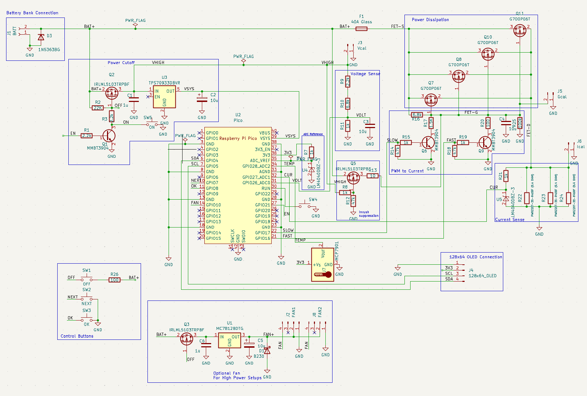
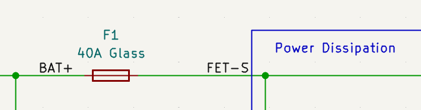
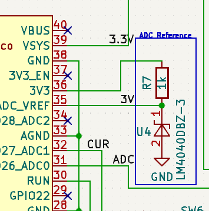

# lipo_battery_drainer
This project describes hardware to safely discharge LIPO batteries to storage levels

# WARNING

Everything described in this document is preliminary and untested and could be hazardous.  Following anything written in this document is at-your-own risk.

## Parts list

https://docs.google.com/spreadsheets/d/1cjAQ268wM6tvXvhV_kM2y3uYFPqvaHXufrr3GAKTqXQ/edit?usp=sharing

## Schematic Overview

Note that the images below are a snapshot of the schematic and not fully
up-tp-date.  See the kicad original for the latest design.

Here is the complete design (click to expand):

Here is an early falstad simulation that gives a basic idea of how the cicuit works:

https://tinyurl.com/2qg4xwyj

There is much going on here.  The sections below break down and explain one subcircuit at a time.

### Power Dissipation

[falstad model](https://tinyurl.com/28p9fv3n)

This is a set of 4 P-Channel MOSFETs connected in parallel:

More or less could also work.  More means more overall current and better heat
dissipation but also additional cost and board space.

These are intended to be run in the "Ohmic" region of the FETs which
is controlled by the gate-to-source voltage (Vgs) as exampled in the FQP27P06
datasheet graph below:

> Note: The schematic has been updated to use an alternate PFET due to the FQP27P06 no longer being produced.

### Vgs Control

[falstad model](https://tinyurl.com/2bj46fut)

To achieve the target Vgs for the MOSFETs, we use a capacitor as detailed
below:

The main element here is the 10u capacitor on the right side of the image.  This capacitor is filled and emptied to set the Vgs that each MOSFET will see.

Filling the capacitor is the 5k resistor, R16.  If only this resistor and the capacitor existed, then the RC constant would be 5000 * 10e-6 = 50ms.  When the
capacitor is sufficiently charged, the MOSFETs will be turned off.

The two transistor networks are used to drain the capacitor.  The one on the left
is a "slow" drain and the one on the right is a "fast" drain.  The size of the resistors (R17 and R20) at the collector determines the drain speed.  A microcontroller feeds in a PWM signal with a varying duty cycle to control how
much charge they pull from the capacitor thus determining the Vgs value.

In the power-on state, we can assume that SLOW and FAST are not driven at all (high Z).  In this state the two 50k pulldowns (R14, R18) turn off Q6 and Q9
allowing the capacitor to fill up and turn off all MOSFETs.

The 100K pull down resistor slowly drains the capacitor so that it is in a known
state (0V) when the unit is unplugged and idle.  Omitting can create a situation
where Vgs is temporarily higher than the plugged in battery, which could lead to
some side effects such as temporary Vgs oscillation as the firmware searches for
the correct duty cycles for SLOW and FAST.

## Inrush protection

[falstad model](https://tinyurl.com/2y8c54c8)

There is inrush current potential on initial plugin as the 100ms or so it takes
the capacitor (C4) to charge via R16 could allow a high current to pass through
the FETs for that time period.  This is mitigated by the following inrush
protection circuitry:

Fully understanding this block will require studying the full schematic.  A
partial understand can be gained from the image above and the falstad model.  We
basically have another way to fill the capacitor C4 which is "enabled" when the
battery is plugged in but the user has not pressed the power button yet.  The
way this works is that the source of the MOSFET (2) is connected to the battery
and the small 10 ohm R13 allows for a rapid fill.  R8 is connected to the
microcontroller power and is thus grounded on initial power on, turning "on" the
FET.

When the user powers on the device (after the battery is plugged in), there is
voltage near-battery going to R8 which turns off the FET and disables the inrush subcircuit.

### Current Sense 

[falstad model](https://tinyurl.com/253e6aln)

One of the four ways the microcontroller decides where to set Vgs is by
monitoring the current flowing through the FETs  (the other three are voltage,
power, and temperature).  This is done with a low-side sense circuit which is a
resistor that indicates the current via a voltage drop.  This voltage drop is
measured with an ADC on the micorcontroller.  

In many cases, minimizing the power loss through this sense resistor is
desirable so a small resistance will be chosen and the corresponding low voltage
drop will be amplified in an attempt to get enough ADC resolution.

Because powerloss *is* the goal here, we instead choose power resistors that directly provide a full (3V) drop at around 30V input.  To safely get there, I chose 3 35W 0.4 ohm resistors connected in parallel for a total dissipation capability of ~100W and an equivilent resistance of 0.133 ohm.

A zener diode (U5) is used to protect the ADC of the microcontroller in the
event that the divided voltage is too high (> 3V).  The microcontroller firmware
may have to know that any measurement above 3V translates to >= 3V and not
exactly that.  In normal use, this case should not occur.

### Protection Fuse

We also have a protection fuse to help protect against software faults or other unexpected problems.  More protection would be offered if the fuse were right at the battery input but this would introduce a further temperature-dependent voltage drop that would throw off the voltage measurement.  The "unprotected" components
are the digital logic which should be low current draw barring a physical issue with the board (< 100 mA)

### Voltage Sense

[falstad model](https://tinyurl.com/2aavu5hb)

The microcontroller monitors the overall battery voltage to determine a sag value and to determine when the drain process is completed.

The circuit is a simple voltage divider with a capacitor to help stabilize the reading.

Sag is determined by periodically turning off the FETs (say for one second every 15 seconds) and measuring the "unloaded" voltage of the pack.  This can then be
used a reference value to determine the sag.

The voltags at R9 is not exactly the battery voltage as it has to pass through a a diode and FET.  The micorcontroller calculations will attempt to compensate for the drop.

### Temperature Sense

A temperature sensor will be placed against the heatsink to get an idea of of
overall temperature of the FETs and power resistors.  This feedback can be used
to control a cooling fan (described below) and, if this is inadequate, reduce
the power dissipation via FAST and SLOW PWM signals (as described earlier).

### Power cutoff

[falstad model](https://tinyurl.com/22wuu5mp)

The LIPO drainer is designed to draw nearly zero power (outside of parasitic losses) when it is off, including after the discharging has completed.  Thus the user can leave the unit unattended (assuming the needed precautions have been taken) without concern of overdraining.

This is implemented with the following circuit:

The Q2 FET is key.  It determines if the microcontroller gets any power.  If the microcontroller has no power, then the power FETs described earlier naturally enter an "off" state.

Q2 is off by default, turned off by R2.  There are two ways to turn it on:

1. If the user presses SW5, then the FET will be pulled to ground turning on Q2
2. If the microcontroller activates Q1 via "EN", then the FET will be turned on as well.  The microcontroller does this as soon as it can (in a split second) and holds it high until the microcontroller decides that it is time to power down.

### ADC reference

When using an ADC, one can typically choose from several different sources for the ADC max voltage with the internally-generated 3.3V source as the most convenient.  The downside of choosing this source is accuracy as the source is not optimized for the application.

This design uses the alternate `ADC_VREF` input with a `LM4040` voltage reference
to allow for more accurate measurements.

### OLED connection

The design breaks out an I2C connection that is typical for an I2C OLED.  A 128x64 design is the intended unit but anything that supports I2C could be supported with appropriate firmware.

### Fan connection

[falstad model](https://tinyurl.com/26cncr9p)

The LIPO generator effectively converts battery energy to heat, thus you'll need
a cooling strategy to avoid overheating and damaging the discharge circuit.
Like cooling other devices such as CPUs and GPUs, a passive solution is
sometimes adequate and an active solution is often needed.

The circuitry below supports a PWM-based fan controller.

This controller feeds the full battery voltage into the fan as PWM pulses.  These pulses interact with the natural inductance of the motor to create a basic "buck converter" circuit.  The diode "D1" acts as a flywheel, allowing the motor to power itself when the Q3 is closed and avoiding negative voltage spikes at the drain of Q3.

There are many motor controllers ICs available on the market.  The reason they were not chosen here is because the maximum battery input voltage (30V) exceeds the specifications of most of these controllers.  Also many of these controllers provide an H-bridge solution, which is overkill here (we don't need to run the fan in reverse).

### Control Buttons

Besides the ON and "reset" buttons, we have an OFF, Next and OK button.

OFF is directly connected to the poweron circuit, described above.  It
cuts power to the microcontroller without any negotiation.

NEXT and OK are used by the microcontroller to implement a simple UI.
More complex UI functions (mostly setup, calibration, and preferences) can
be configured using the USB interface of the Pico with associated firmware
support.

### PI Pico Microcontroller

As is typical, a microcontroller orchestrates the effort.  Here I chose a PI Pico because it is inexpensive and quite capable.  It's main downside is the lack of a low-power sleep mode, but the Power cutoff circuit explained above compensates for this shortcoming.

A little bit on the tasks the Pico must attend to:

1. When the unit is powered-up, the Pico must raise the EN pin to keep the power active.  It must lower the EN pin when it is time to shutdown.
2. It controls the dissapation rate of the main FETs via PWM signals on the SLOW and FAST pins.
3. It measures current by ADC decoding the voltage at the CUR pin.
4. It measures the battery voltage via an ADC.
5. It provides an output display via SDA and SCL
6. It controls the fan speed (if present) via the FAN pin.
7. It may monitor the buttons B1, B2, B3, B4 and ON to as a part of user control.

## Calibration

There are a couple of calibration points on the circuit.

1. Vcal is used to determine the voltage at the top of the resistor divider.  If the user measures this and the actual battery voltage, the system can have some idea of what the voltage drop between the two is and compensate for it.  This will not be perfect due to other factors (temperature, current), but it the hope is that the error will be acceptable.
2. Ical is used to determine the actual current.  The user will measure the resistance across these pins.
