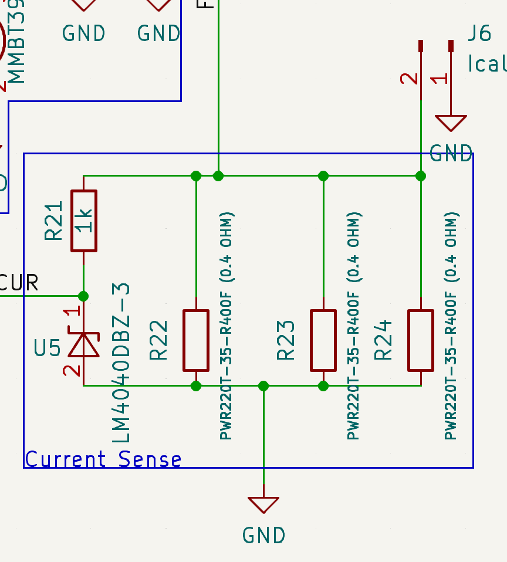
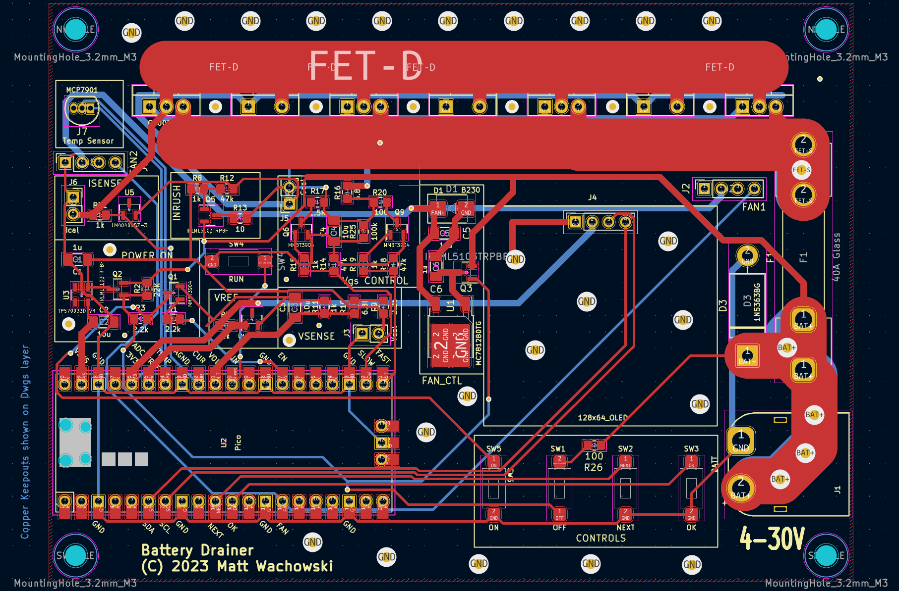

# battery_drainer

This project describes hardware to safely discharge batteries to a user-chosen
level.


# Why?

Before I started flying RC models (many years ago), the concept of managing
batteries was off my radar.  While in the hobby, it became clear that proper
management makes a big difference in how long batteries last and how much power
they will deliver.

Storing lithium ion batteries fully-charged or fully-drained causes them to
degrade permanently.  It's much better to store them in a half-charged state.

Since lithium batteries are used basically everywhere (phones, tools, laptops,
    cars, on and on), being aware of these concepts can help you keep more of
your devices running longer and more healthy.

Many non-lithium batteries have "memory effects" and can benefit from a deep
discharge now and then.  See your particular battery type for details on how to
maintain/restore it.

Other applications for discharging include testing battery capacity and
preparing it for disposal.

# Caution

Following anything written in this document is at-your-own risk.

Batteries are energy storage devices and thus carry an inherent risk.  If you
are not familiar with the battery type you are working with, take a few moments to
educate yourself on recommended handling practices.

# Pre-existing Market Solutions

If you look up "LIPO Battery Discharger" on Amazon or similar, you will find a
variety of products.  These might work for you but note that the project I am
describing has some advantages over what you can buy:

1. Higher maximum power.  The unit I built is running great at 350W.  The components
   I chose are speced to 460W and 30A.  Since you are building it yourself,
   you can choose a transistor/cooling combo that supports the power dissipation
   you need.
2. Support for "safe" multiboards.  My project has a diode-protected multiboard
   that allows you to safely plug in multiple batteries that are at different 
   discharge levels. This protection requires the discharger account for the 
   voltage drop across the protection diodes, which commercial charges do not
   typically do.
3. Support of 1S packs.  Many chargers have a 2S minimum.
4. Lots of customization.  My project lets you customize voltages and
   create special profiles.  For example, I have one that takes packs down to
   4V/Cell, which is useful for packs that I want ready-to-use in worklights and tools.
5. Detailed status.  The OLED of this project gives lots of information
   during the discharge which can help you guage the health of the pack.
6. Support for more battery types than just LIPO, due to the extensive 
   customization ability.

# Using

## User Interface

The unit has four UI buttons: On, Off, Select and OK.


When the device is initially powered up, it will display the current voltage,
cell count and the target voltage.  It also shows a scrollable list of
profiles to choose from:


The user chooses a profile with "Select" and presses "OK" to start discharging.
During discharge, the following status information is displayed (the ghosting
in the image is because the unit was actively updating during the photo):


Information shown includes:

* Time running
* Number of mAH discharged so far
* Battery voltage and cell count
* Target voltage
* Discharge Current
* Power (Voltage * Current)
* Temperature
* FET power level %
* Fan power level %

If the FET power level is limited < 100%, then the parameter that is limiting
the power is highlighted as inverse text.  In the example above, this limit is
overall power draw.  A lower-cell-count battery might hit the max current
instead.  A small battery might be limited by voltage sag.  A hot day might
introduce a temperature limit.  All limits are user configurable - but you'll
need to be aware of what your built hardware can handle and test higher limits
with due caution.

When the discharge is complete, the unit will show some stats for a configurable
amount of time before automatically shutting down.  Here is an example:


After shutdown, the unit takes very little power (a few microamps) to avoid
further unintended drainage of smaller packs.

## Configuration

Profiles can be edited by connecting a computer to the unit via USB and starting
a terminal program.  On my Linux laptop, I used:

    minicom -b 115200 -P /dev/ttyUSB0

Refer to the [dedicated configuration guide](configuration.md) for details
about how to configure settings, calibrate the device and create/edit profiles.

# Building

## Parts list

To see the parts list, open up the schematic in KiCad and look at the "Symbol
Fields Table".  It looks like a spreadsheet icon in the UI.  Here you will find
a list of parts and links for building an order.  Here is a snapshot of what
the list looked like at some point:


## Schematic Overview

Note that the images below are a snapshot of the schematic and not fully
up-tp-date.  See the KiCad original for the latest design.

Here is the complete design (click to expand):


Here is an early Falstad simulation that gives a basic idea of how the circuit
works:

https://tinyurl.com/2qg4xwyj

There is much going on here.  The sections below break down and explain one
subcircuit at a time.

### Power Dissipation

[Falstad model](https://tinyurl.com/28p9fv3n)

This is a set of 4 P-Channel MOSFETs connected in parallel:


More or less *could* also work.

**Note** The schematic shows four PFETs in parallel.  The unit *I actually
built* uses a single high-power FET instead.  I think that four PFETs would
still work but have not confirmed it.  The main risk of using 4 is that they
will be unevenly loaded to the point where one of them is damaged.  I do
believe that they will be unevenly loaded at lower currents but not after the
current ramps up enough to matter.  Again, I have not confirmed this.  Using a
single high-power FET is my recommendation if you want to play it safer.

The FETs in this design are (unusually) run in their "Ohmic" region which
is controlled by the gate-to-source voltage (Vgs) as exampled in the FQP27P06
datasheet graph below:


### Vgs Control

[Falstad model](https://tinyurl.com/2bj46fut)

To achieve the target Vgs for the FETs, we the following circuit:


The main element here is the 10u capacitor on the right side of the image.
The voltage across this capacitor is the gate voltage that
each FET will see.

Filling the capacitor is the 5k resistor, R16.  If only this resistor and the
capacitor existed, then the RC constant would be 5000 * 10e-6 = 50ms.  When the
capacitor is sufficiently charged, the FETs will be turned off.

The two transistors (Q6, Q9) are used to drain the capacitor.  The one on the
left is a "slow" drain and the one on the right is a "fast" drain.  The size of
the resistors (R17 and R20) determines the drain speed.  A microcontroller
feeds in a PWM to open/close the transistor.  The duty cycle of this PWM
signal determines how much current is pulled on average and the frequency
of this PWM signal determines how smooth/stable the voltage will be.

The reason for two drains (verses one) is to support a larger voltage
range.  At lower voltages (4V), the FAST drain circuit is needed
to get the Vgs lower than the SLOW drain can achieve.  For higher voltages
(25V), the SLOW drain provides better control resolution.  Depending on the
FET you go with and voltage range you want to support, a single drain
may work fine.

In the power-on state, we can assume that SLOW and FAST are not driven at all
(high Z).  In this state the two 50k pulldown resistors (R14, R18) turn off Q6
and Q9 causing the capacitor to fill up and turn off the main power FETs.

The 100K pull down resistor (R25) slowly drains the capacitor so that it at a known
voltage (0V) when the unit is unplugged and idle.

## Inrush protection

[Falstad model](https://tinyurl.com/2y8c54c8)

On initial battery plug-in, the 100ms or so it takes the capacitor (C4) to
charge via R16 could allow a high current to pass through the FETs for that
time period.  This is mitigated by the following inrush protection circuitry:


Fully understanding this block will require studying the full schematic.  A
partial understand can be gained from the image above and the Falstad model.  We
basically have another way to fill the capacitor C4 which is "enabled" when the
battery is plugged in but the user has not pressed the power button yet.  The
way this works is that the source of the FET Q5 is connected to the battery
and the small 10 ohm R13 allows for a rapid fill.  R8 is connected to the
microcontroller power and is thus grounded on plug-in, turning "on" the
FET.

When the user powers on the device (after the battery is plugged in), there is
voltage near-battery going to R8 which turns off the FET and cuts off R13.

### Current Sense 

[Falstad model](https://tinyurl.com/253e6aln)



One of the four ways the microcontroller decides where to set Vgs is by
monitoring the current flowing through the FETs  (the other three are voltage,
power, and temperature).  An ADC within the microcontroller measures the voltage
across the resistors (R22-R24) then uses Ohm's law (I = V/R) to determine the
current.

Resistor values were chosen for a full 3V swing at 30A of current, this allows
us to use the full 12-bits of ADC resolution for good accuracy.  The downside
is that 3V * 30A = 90W, which is a lot for a resistor to dissipate.  To support
this, I chose 3 35W 0.4 ohm resistors connected in parallel for a total dissipation
capability of ~100W and an equivalent resistance of 0.133 ohm.  Potentially
wasting this much power on a current measurement would normally be frowned upon but
in this application it's actually helping take some load off the main power FET.

A Zener diode (U5) is used to protect the ADC of the microcontroller in the
event that the divided voltage is too high (> 3V).  This is a protection
feature that serves no function under "normal" operating conditions.

### Protection Fuse


We also have a protection fuse to help protect against software bugs or other
unexpected problems.  More protection would be offered if the fuse were right at
the battery input but this would introduce a further temperature-dependent
voltage drop that would throw off the voltage measurement.  The "unprotected"
components are the digital logic which should be low current draw barring a
physical issue with the board (< 100 mA)

### Voltage Sense

[Falstad model](https://tinyurl.com/2aavu5hb)


The microcontroller monitors the overall battery voltage to determine a sag
value and to determine when the drain process is completed.

The circuit is a simple voltage divider with a capacitor to help stabilize the
reading.

Sag is determined by periodically turning off the FETs (say for one second every
15 seconds) and measuring the "unloaded" voltage of the pack.  This can then be
used a reference value to determine the sag.

The voltage at R9 is not exactly the battery voltage as it has to pass through a
a diode and FET.  The software provides a calibration value to account for this
drop.

### Temperature Sense


A temperature sensor is placed against the heatsink and as-close-as-possible to
the FET to monitor the FET temperature.  This feedback can be used to control a
cooling fan (described below) and, if this is inadequate, reduce the current draw.

### Power cutoff

[Falstad model](https://tinyurl.com/22wuu5mp)

The battery drainer is designed to draw nearly zero power (outside of parasitic
losses) when it is off, including after the discharging has completed.  Thus the
user can leave the unit unattended (assuming the needed precautions have been
taken) without concern of parasitic drain.

This is implemented with the following circuit:


The Q2 FET is key.  It determines if the microcontroller gets any power.
Q2 is off by default, turned off by R2.  There are two ways to turn it on:

1. If the user presses SW5
2. If the microcontroller activates Q1 via "EN".  The microcontroller does
   this as soon as it can (in a split second) and holds it high until the
   microcontroller decides that it is time to power down OR the user presses
   the "OFF" button which forces Q2 off.

### ADC reference


When using an ADC, one can typically choose from several different sources for
the calibration with the internally-generated 3.3V source as the most
convenient.  The downside of choosing this source is mediocre accuracy.

This design uses the alternate `ADC_VREF` input with a `LM4040` voltage reference
to allow for more accurate measurements.

### OLED connection


The design breaks out an I2C 4 pin header that is typical for an I2C OLED.  A
128x64 design is the intended unit but anything that supports I2C could be
supported with appropriate firmware modifications.

### Fan connection

The battery drainer effectively converts battery energy to heat, thus you'll need
a cooling strategy to avoid overheating and damaging the discharge circuit.
Like cooling other devices such as CPUs and GPUs, a passive solution is
sometimes adequate and an active solution is often needed.

The circuitry below supports a PWM-based fan controller.


The circuit is just a 12V linear regulator with supporting capacitors.  The
connections support "PWM" style PC case fans which generally accept a 25Khz
PWM signal on pin 4.

A flyback diode is needed when powering generic motors but is unlikely to be
needed here as PWM-controlled motors usually already have one in the motor
control circuit.  You can add one for peace-of-mind if you choose.

### PI Pico Microcontroller

As is typical, a microcontroller orchestrates the operation.  Here I chose a PI
Pico because it is inexpensive and quite capable.  It's main downside is the
lack of a low-power sleep mode, but the Power cutoff circuit explained above
compensates for this shortcoming.


A little bit on the tasks the Pico must attend to:

1. When the unit is powered-up, the Pico must raise the EN pin to keep the power  
   active.  It must lower the EN pin when it is time to shutdown.
2. It controls the dissipation rate of the main FETs via PWM signals on the SLOW 
   and FAST pins.
3. It measures current by ADC decoding the voltage at the CUR pin.
4. It measures the battery voltage via an ADC.
5. It provides an output display via SDA and SCL
6. It controls the fan speed (if present) via the FAN pin.
7. It monitors the buttons Select and OK buttons.

## PCB Layout



The PCB layout is above.  Some notes on the layout:

* The dimensions of the board are 122 x 88 mm (4.8 x 3.5 inches)
* Power FETs and resistors are aligned so that a single (large) heatsink can service all of them
* Large traces are used in the higher current areas.
* Large vias are used to try and distribute current and reduce hotspots. 

I went with thicker 2oz copper when manufacturing this board to handle the potentially-large current.

Here are some images of the board, unpopulated and with most components added:


Note that the completed board had a bug where I forgot to add a power-cutoff to
the fan.  If not corrected, this could have caused the fan to draw ~5-10 mA even
after charging is completed.  The fix was to add a PFET (green wires).  The
board design now incorporates the FET on the board.

## Daughterboard

You could plug a single battery into the unit or use a parallel adapter.  Safer
than a parallel adapter would be a board with integrated diodes.  This will
allow batteries of different charge levels to be plugged in without the concern
of large current flows due to unequal discharge levels.  The firmware can
account for the drop across the diodes after the user calibrates the board.  

A bundled example provides connection for 6 XT-60 packs.  Changing the number of
packs or the connector type is of course doable:


# Firmware

If you don't want to build the firmware yourself, there is a prebuilt
version [here](https://github.com/mattwach/battery_drainer/tree/main/firmware).

The firmware, `battery_drainer.uf2` is in a standard PI Pico format.  One
way to download it is to mount the Pico as a USB drive and copy over the file.
Refer to beginner PI Pico tutorials for more information, such as
[this one](https://datasheets.raspberrypi.com/pico/getting-started-with-pico.pdf).

If you do not wish to build the firmware yourself, feel free to skip to the
next section.

The firmware is build using a script that wraps the official pico build
system.  To run it, you execute `bootstrap.sh` which exists in [the src/ directory](https://github.com/mattwach/battery_drainer/tree/main/src).

    ./bootstrap.sh
    cd build
    make -j

Let's take a look inside the file:

```
$ cat bootstrap.sh 
#!/bin/bash

if [ ! -f lib/pico_uart_console/CMakeLists.txt ]; then
  git submodule init
  git submodule update
fi

rm -rf build
mkdir build
cd build
cmake ..
```

All standard git and cmake operations which you can execute individually
if you prefer (or are running in an environment where executing `bootstrap.sh`
directory will not work).


# Case Design

For cooling, I ended up going with [2 120x69x36 mm finned alunimum heatsinks](https://www.amazon.com/gp/product/B07TJY3GKP) which cost me $13 each for a
total of $26.  These work great but having to use two is a bit inconvenient, due
to the vertical seam in the center.  I tapped holes in these heatsinks, both
for mounting the board and for holding the FETs, resistors, and temperature
sensors securely to the heat sink (with the aid of thermal paste to complete
the thermal connection).


On the backside of the heatsink, I have a 120mm fan which blows air into the
fins.  The microcontroller controls fan speed based on current temperature
and power dissipation.

At first everything was held together with wires.  I wan't sure if a 3D printed
solution would be able to tolerate the dissipated heat.  But after experiencing
with the unit and doing official (temperature probe, IR camera) and non official measurements (finger touch), I determined it would probably be ok.

I ended up designing a case using Open SCAD:


Design files are included with the project [here](https://github.com/mattwach/battery_drainer/tree/main/case).  Ready to print models
are [here](https://github.com/mattwach/battery_drainer/tree/main/case/export).

After many uses, the case is holding up fine with no signs of warping.  Note that I used PETG for the case as PLA has a tendency to "creep" over time, even
at slightly elevated temperatures.

The front plate is acrylic.  I used a 3018 CNC machine to cut it out.  Printing
a cover or making something by hand are of course other options,
